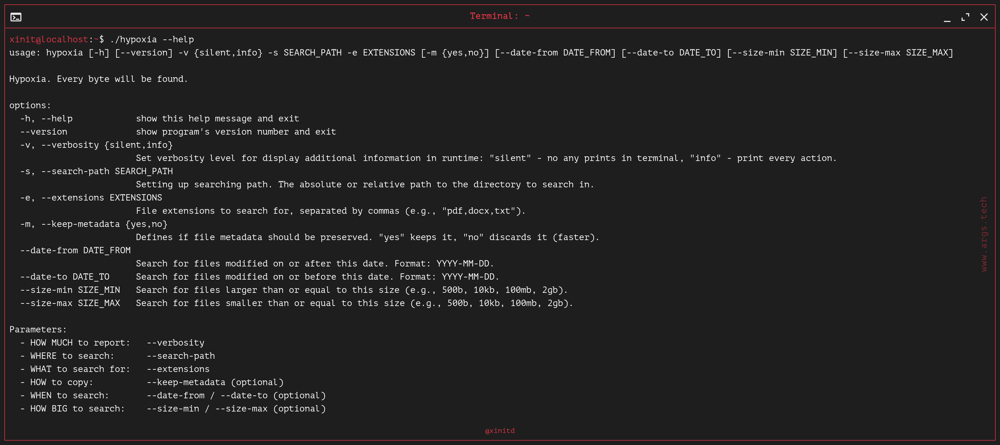

<div align="center">

  

  <h2>HYPOXIA</h2>

  <p>
    <a href="#about">About</a>
    ·
    <a href="#installation--usage">Installation & Usage</a>
    ·
    <a href="#command-line-options">Command-Line Options</a>
  </p>
  
  
  
  
</div>

<div align="center">
  <h3 align="center">About</h3>
</div>



**Hypoxia** is a lightweight, dependency-free, cross-platform command-line tool designed for targeted file extraction and backup. Written entirely in standard Python, it recursively searches directories and collects files based on a granular set of criteria - including extensions, modification dates, and file sizes.

Built for efficiency and portability, Hypoxia is the perfect utility for digital forensics specialists, system administrators, and security researchers who need to rapidly gather digital evidence, construct specific archives, or recover data from mounted, unbootable filesystems.

<div align="center">
  <h3 align="center">Key Features</h3>
</div>

- **Zero Dependencies:** Written in pure Python (3.11+). No `pip install` required.
- **Cross-Platform:** Runs seamlessly on Windows, macOS, and Linux.
- **Granular Filtering:** Collect exactly what you need by combining filters:
  - **Extensions:** e.g., `pdf`, `docx`, `jpg`.
  - **Date Ranges:** Files modified after, before, or within a specific timeframe.
  - **Size Boundaries:** e.g., files strictly between `10mb` and `2gb`.
- **Disk Space Awareness:** Monitors free space on the destination drive in real time, issuing warnings and safely halting execution before the disk fills up completely.
- **Metadata Control:** Choose to preserve original file metadata (timestamps, permissions) or discard it to maximize copy speed.
- **Forensic Manifest:** Automatically generates a JSON manifest for every collection task — SHA-256 hash, original path, destination path, file size, timestamps, and an overall manifest checksum for integrity verification.
- **Chain of Custody Log:** Append-only forensic log with timestamped entries for every action (file copied, skipped, errors), establishing a verifiable chain of custody.
- **Checkpoint/Resume:** If a collection is interrupted (crash, power loss, dying media), feed the forensic log back with `--resume` — Hypoxia continues from exactly where it stopped, verified by path and hash. No wasted time, no duplicates.
- **Archive Output:** Compress the entire collection into a `.zip` archive with a single flag.
- **Directory Exclusion:** Skip unwanted directories by name (e.g., system folders, `.git`).
- **Secure & Robust:** Relies exclusively on Python's standard library (`argparse`, `pathlib`, `datetime`, `shutil`, `hashlib`, `json`, `zipfile`), ensuring maximum compatibility and minimizing security risks.

<div align="center">
    <h3 align="center">Use Cases</h3>
</div>

- **Digital Forensics:** Rapid evidence gathering with SHA-256 hashing, forensic manifest, and chain-of-custody logging.
- **Incident Response:** Collect files from a compromised machine with a single command. Resume interrupted collections from dying media without re-copying.
- **Data Backup:** Targeted backups of specific file types or recent documents, with integrity verification built in.
- **Disaster Recovery:** Extracting files from corrupted or unbootable operating systems.

<div align="center">
  <h3 align="center">Installation & Usage</h3>
</div>

#### As a Standalone Executable:

1. Download the [latest release](https://github.com/xinitd/hypoxia/releases/latest).

2. Make it executable and run:

```bash
chmod +x hypoxia
./hypoxia --help
```

#### As a Python Script:

1. Ensure Python 3.11+ is installed.

2. Clone the repository:

```bash
git clone https://github.com/xinitd/hypoxia.git
cd hypoxia
```

3. Make the script executable and run:

```bash
chmod +x hypoxia.py
./hypoxia.py --help
```

#### Quick Example:

Search the `/mnt/data` directory and all its subdirectories for `.jpg`, `.mp4`, and `.mov` files modified between January 1st and March 31st, 2025, and sized between 1MB and 2GB.

This command preserves metadata by default and outputs detailed logs to the terminal:

```bash
./hypoxia -v info -s "/mnt/data" -e "jpg,mp4,mov" --date-from "2025-01-01" --date-to "2025-03-31" --size-min "1mb" --size-max "2gb"
```

<div align="center">
  <h3 align="center">Command-Line Options</h3>
</div>

| Option | Description | Required | Default |
| --- | --- | --- | --- |
| `--version` | Display the current version of Hypoxia and exit. | No | - |
| `-v`, `--verbosity` | Set the logging level (`silent` for no output, `info` to log all actions). | Yes | - |
| `-s`, `--search-path` | The absolute or relative path to the directory to scan. | Yes | - |
| `-e`, `--extensions` | Comma-separated list of file extensions (e.g., `pdf,docx,txt`). Do not include dots. | Yes | - |
| `-m`, `--keep-metadata` | Preserve original file metadata (timestamps, permissions) during copy. | No | `yes` |
| `--date-from` | Filter for files modified on or after this date (`YYYY-MM-DD`). | No | - |
| `--date-to` | Filter for files modified on or before this date (`YYYY-MM-DD`). | No | - |
| `--size-min` | Minimum file size (e.g., `100mb`). Supported units: `b`, `kb`, `mb`, `gb`. | No | - |
| `--size-max` | Maximum file size (e.g., `2gb`). Supported units: `b`, `kb`, `mb`, `gb`. | No | - |
| `--exclude` | Comma-separated list of directory names to exclude from scan (e.g., `windows,program files,.git`). | No | - |
| `--zip` | Compress the output folder into a `.zip` archive after collection. | No | `false` |
| `--hash` | Hash algorithm for forensic manifest (`sha256`, `sha512`, `md5`, `none`). | No | `sha256` |
| `--resume` | Path to a forensic log from a previous interrupted run. Resumes from where it stopped. | No | - |

<div align="center">
  <h3 align="center">Legal Disclaimer</h3>
</div>

> **For authorized use only.** This tool is designed exclusively for use on devices and networks you own or have explicit permission to audit. The authors and contributors assume no liability and are not responsible for any misuse, damage, or legal consequences caused by this program.
