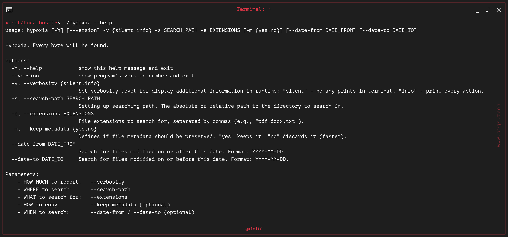

  

  <h2>HYPOXIA</h2>
  

    <a href="#about">About</a>
    ·
    <a href="#usage">Usage</a>
    ·
    <a href="#settings">Settings</a>
  

  
  
  

  <h3 align="center">Disclaimer</h3>

> [!WARNING]
> This project can only be used on devices owned by you. You can't use this project for evil intent. Authors and contributors are not responsible for possible consequences.

  <h3 align="center">About</h3>

Hypoxia is an open-source forensic and backup creation tool, designed for security researchers and system administrators. This utility may be used for data analysis (metadata extraction), backup creation and file recovering.

Use cases:
- Forensic;
- Backing up data;
- Recovery files from PC with broken operating system.

  <h3 align="center">Technical information</h3>

Programming language: `Python`

Requirements:
* There is no need to install dependencies. They simply do not exist. Just install Python version `3.11` or newer for using as Python script.

  <h3 align="center">Usage</h3>

#### Standalone executable:

* Download [latest release](https://github.com/xinitd/hypoxia/releases)
* Set executable flag: `chmod +x hypoxia`
* Run: `./hypoxia --help`

#### As Python script:

* Install Python
* Clone repo `git clone https://github.com/xinitd/hypoxia.git`
* Go to project folder `cd hypoxia`
* Set executable flag: `chmod +x hypoxia.py`
* Run `$(which python) hypoxia.py --help`

#### Settings:

* `-v` or `--verbosity` - needs for print data about working of program. This parameter required and have two values: `silent` - no any prints in terminal, `info` - print every action and path of copying file.
* `-s` or `--search-path` - set path where you want look up files. This argument required and have no default value.
* `-e` or `--extensions` - put file extensions, which you want be found.
* `-m` or `--keep-metadata` - metadata saving mode for collected files: `no` - copy files without metadata (faster), `yes` - attempts to keep all metadata.
